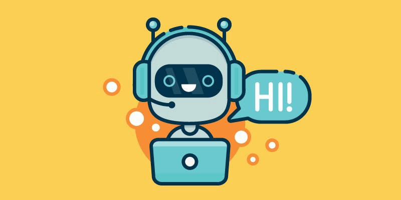

# Multi_Model-Chat-App 



## `Overview`

Welcome to the Custom Multi-Model Support Chat Bot, an advanced AI-powered application that allows you to choose your desired Language Model (LLM) from a variety of options. This chat bot is developed using models hosted on the [Hugging Face Model Hub](https://huggingface.co/models) and is designed to provide a seamless and customizable conversational experience based on cutting-edge AI models.


`Deploy Link =>` https://huggingface.co/spaces/Saurabhgk18/custome_chatbot

### `Technology Stack`

##### 1. Language Models (LLMs)

We leverage state-of-the-art language models hosted on the Hugging Face Model Hub to power our chat bot. You can choose from a variety of pre-trained models, each offering unique capabilities. Explore models from [Hugging Face](https://huggingface.co/models) and other leading sources to enhance your conversational experience.

##### 2. Python

The backend of our Chat Bot is built using Python, a versatile and powerful programming language. Python's extensive ecosystem of libraries and frameworks makes it an ideal choice for developing AI applications.

##### 3. Streamlit

The user interface of our application is developed using Streamlit, a user-friendly Python library for creating web applications with minimal code. Streamlit allows for quick prototyping and deployment, making it easy for users to interact with the chat bot effortlessly.

### Getting Started

1. Clone this repository.
   ```bash
   git clone https://github.com/your-username/custom-chat-bot.git
   cd custom-chat-bot
Install the required dependencies.

bash
Copy code
pip install -r requirements.txt
Run the application.

bash
Copy code
streamlit run chatapp.py
Open your web browser and navigate to http://localhost:8501 to start using the Chat Bot.


## `Deployment on Hugging Face Spaces`
Our Chat Bot is deployed on Hugging Face Spaces for easy access and sharing. You can interact with the bot directly on our [Hugging Face Space](https://huggingface.co/spaces/Saurabhgk18/custome_chatbot) .

### `Features`     
 - Multi-Model Support: Choose from a variety of LLMs to tailor the chat bot to your preferences.         
 - Advanced AI Capabilities: Benefit from the latest advancements in natural language processing and understanding.       
 - User-Friendly Interface: Streamlit provides an intuitive interface for seamless interaction.      
 - Feel free to explore, customize, and contribute to the development of our Custom Multi-Model Support Chat Bot. For more information,      
   check out the documentation and source code available on our GitHub repository.

Happy chatting!
